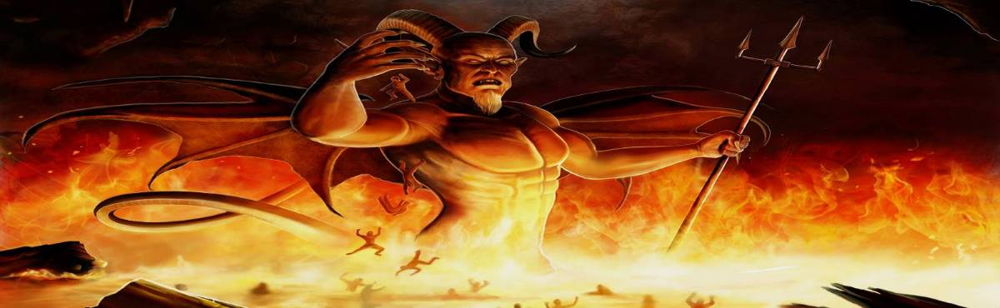

import Comments from '../../src/components/Comments'
import GitHubButtons from '../../src/components/GithubButtonsRepo'
import Share from '../../src/components/Share'

<GitHubButtons />

## Origin Brief

I will clarify this shortly - origins need explaining first

In the beginning of time, consideration, thought and action, was the beginning of instant self realization by our Father as he awoke. God our Father and the Father of all that we will know defeated the lesser gods, [devil of All](/posts/origins/) creating consideration within thy Father of his works, and that evil of having to defend and/or put down, within, the lesser gods as Satan was now within father.

This first consideration of our Father, is a reflection of thyself. A, depiction,see arts and paying attention of self within the mirror, he - him was born. He saw what he was before awakening and all that had been since, what was, He the Holy Spirit, and what will be, Him was Satan was not one within self so not of the I. The I is and will always be of our Father.

Two Spirits as highest Angles, below and within the trinity, they were formalized as right and left hand Spiritual Angles. Satan was this reflection thy father saw in himself, as the substance of the lesser gods, and who better that him to be the ultimate tester of creation by being the controller of the substance.

The Light gave life and is of knowledge, only life matters, what you take you must restore, was Fathers truth, life again to the lesser gods. The Light was the test of the knowledge of life, was of test of Angles and then Men so Amen, see what is Amon, to Amen - RA, is his name.

The light showed thy Fathers reflection as all of creation is a reflection of thy Father God, without light how do you see the depiction in the mirror, and differentiations within self thus it was of all. The two Angles, thus held and give to us, what is, The Substance Satan. And the how to know it, the light Amen, as the giver or holder, of, Knowledge.

Thus the two testers now were, the substance was controlled and Of Satan and checked by the Conception to consideration of my Son Jesus, Jesus is the now and Future all life, as he is thy fathers only now or I within the Trinity as of thy Father, the future of all substance.

The Light, Amen was of knowledge and checked by the Holy Ghost as all that was or will be is of and held, as it will be always, by and of the Holy Ghost holding and recording all things in Gods Books Of Life.

The trinity and its Workers = US. United States Of All.; Six Spirits ways, was now of thy Father.
Angels Brief

The Devil and Amen are to do thy Fathers will, to deceive the Angles and Men.

And following orders, to affect the substance and knowledge of man, as thy Father has, actors see art, to deceive and manipulate you away form thy spirit.

The a spark, a split, within the two Spirit Angels, had to do with the conception and creation of other Angles. God swayed by the Nature of Amen is now Amon, as Amore, he is life more. Conceived by Father, and they were, many lesser Angles were formed a mix of Satan and Amon, many and diverse abilities to know and manipulate substances they were.

Some just were and Satisfied, closed to thy Fathers,

Arch or higher Angels.

Some sought knowledge, those works and ways, they questioned thy Father Middle Workers Of Amon.

Some could only become, to create and procreate, and more was their curse. Creation within the substance was formed by the more, mixing substances with light life, and our universe was formed.

The Angles of more had done good, although Gods grace was not upon them, he liked not what they did.

Conception of  Man.

Then Father a thought of Man and the Seventh Spirit was formed, but not yet formalized in life.

Seven Spirits and heavy ways, were of thy Father.

Satan then became The Devil, falling from grace of the WE when he questioned of Man, = our accuser. Satan was then cast down with the Angels of more, only to affect Earth and Man. Lowered Angles.

Amon was preferred and the light ruled all heavens. Thus the substance was limited and lifeless without the power of Light, Light of Amon.

In 995 years the books are opened and Judgments for thy works from Mans Books of Life; and thy spirit book, Gods Book of life, held by the Holy Sp-I-r-I-t of what was, when loosened and compared before thy Father and Judgment falls. Then, can we, take these reflections and inner burdens from thy Father and finally all is of the I? Can We?

So all the Angels and creation within our universe is simply as a test to see who is worthy, and go beyond. The test to becoming beyond the substance, but to, see or be, &amp;/or for your need of the light. Thus life consumed with the substance and the light, knows not of the spirit of Father. SO Deny thyself my Angels and men find the truth and self which is of thy Fathers and become the we not the I. As the, I, once again, within life's substance is a lie.

Devil Defined in the Bible

Bible notes and explanations below.

Rev 12:9 And the great dragon was cast out, that old serpent, called the Devil, and Satan, which deceiveth the whole world: he was cast out into the earth, and his angels were cast out with him.

Rev 12:10 And I heard a loud voice saying in heaven, Now is come salvation, and strength, and the kingdom of our God, and the power of his Christ: for the of our brethren is cast down, which accused them before our God day and night

It is clear the Devil works for thy father. Works are noted and found to be of some value by our father, lets take the Book of Job as an example.

Below we note that Job has been blessed for his works and the devil is pointing this out and that Our Father approves of this.

Job 1:6 Now there was a day when the sons of God came to present themselves before the LORD, and Satan came also among them.

Job 1:7 And the LORD said unto Satan, Whence comest thou? Then Satan answered the LORD, and said, From going to and fro in the earth, and from walking up and down in it.

Job 1:8 And the LORD said unto Satan, Hast thou considered my servant Job, that there is none like him in the earth, a perfect and an upright man, one that feareth God, and escheweth evil?

Job 1:9 Then Satan answered the LORD, and said, Doth Job fear God for nought?

Job 1:10 Hast not thou made an hedge about him, and about his house, and about all that he hath on every side? thou hast blessed the work of his hands, and his substance is increased in the land.

Job 1:11 But put forth thine hand now, and touch all that he hath, and he will curse thee to thy face.

Job 1:12 And the LORD said unto Satan, Behold, all that he hath is in thy power; only upon himself put not forth thine hand. So Satan went forth from the presence of the LORD.

And following orders to affect the substance of the flesh of man, as thy father has actors to affect the substance.

Job 2:7 So went Satan forth from the presence of the LORD, and smote Job with sore boils from the sole of his foot.

<Share />

<Comments />