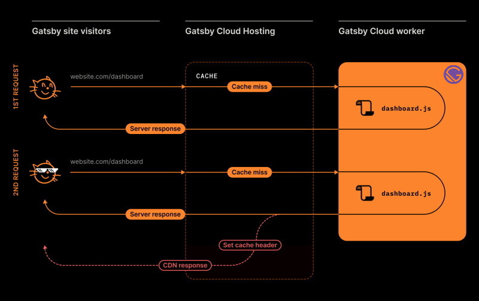

## DEFERRED STATIC GENERATION

> The performance of static sites without all of those long build times

The benefits of statically generated websites - performance, security, reliability - are now available to websites of all shapes and sizes, giving teams a new way to build and deliver digital experiences at scale.

## SERVER-SIDE RENDERING

> Request and render data at run-time with Gatsby

Gatsby 4 now supports Server-Side Rendering, giving developers the choice of generating content at either build time, as with static-site generation, or at run time. With Server-Side Rendering, teams can now run more effective A/B tests, personalize content, and more all while still using the Gatsby framework.

[See More About Gatsby Version Four](https://www.gatsbyjs.com/gatsby-4/)

